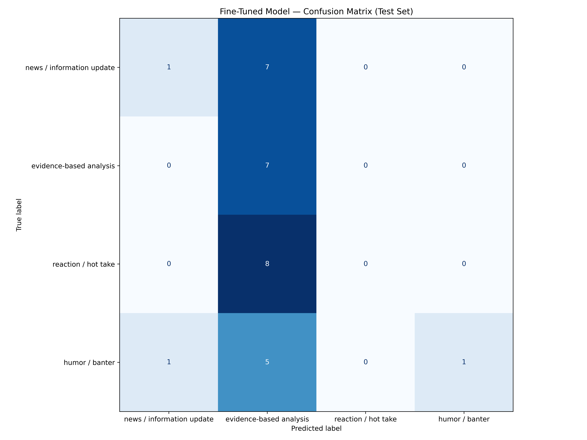

# r/soccer Discourse Classifier

## Project Overview

This project builds a text classifier for discourse in **r/soccer**, a Reddit community where users discuss football news, transfers, match results, tactics, statistics, club drama, jokes, and fan reactions. The goal is to classify each post or comment into one of four discourse categories:

- `news / information update`
- `evidence-based analysis`
- `reaction / hot take`
- `humor / banter`

The main purpose of this classifier is to distinguish substantive football discussion from other common kinds of community discourse. This matters because r/soccer contains a wide range of text quality: some comments provide useful analysis or information, while others are mostly emotional reactions, jokes, or rivalry banter.

## Community

I chose **r/soccer** because it is active, text-heavy, and varied enough for a classification task. A single thread can contain official news, transfer rumors, tactical analysis, emotional reactions, jokes, and low-effort banter. This makes the task more interesting than simple topic classification because two comments can discuss the same player or club but serve completely different discourse purposes.

For example, a comment about a manager could be:

- a news update about the manager being hired or fired,
- an analysis of the manager's tactical approach,
- a hot take saying the manager is finished,
- or a joke about the manager's reputation.

## Labels

| Label | Definition |
|---|---|
| `news / information update` | The text mainly shares football-related information, such as a transfer report, official announcement, injury update, match result, fixture update, or source-based claim. |
| `evidence-based analysis` | The text makes a football argument using reasoning, statistics, tactical explanation, financial context, historical comparison, or specific examples from matches. |
| `reaction / hot take` | The text mainly expresses a strong opinion, emotional judgment, or quick conclusion without much evidence or explanation. |
| `humor / banter` | The text is mainly intended to joke, meme, mock a player or club, exaggerate for comedic effect, or participate in rivalry banter. |

## Dataset

The dataset contains **200 labeled examples** collected from public r/soccer posts and comments. The CSV file contains one complete labeled dataset and is not pre-split.

### Columns

| Column | Description |
|---|---|
| `text` | The post or comment text being classified. |
| `label` | The manually assigned discourse label. |
| `notes` | Optional notes for difficult or ambiguous examples. |
| `source_url` | The public source URL for the example. |

### Label Distribution

| Label | Count |
|---|---:|
| `news / information update` | 50 |
| `evidence-based analysis` | 50 |
| `reaction / hot take` | 50 |
| `humor / banter` | 50 |
| **Total** | **200** |

The dataset is balanced, with each label making up 25% of the full dataset. No label exceeds 70% of the dataset.

## Train / Validation / Test Split

The notebook automatically split the dataset into train, validation, and test sets.

| Split | Examples |
|---|---:|
| Train | 140 |
| Validation | 30 |
| Test | 30 |

### Train Label Distribution

| Label | Count |
|---|---:|
| `news / information update` | 35 |
| `humor / banter` | 35 |
| `reaction / hot take` | 35 |
| `evidence-based analysis` | 35 |

### Test Label Distribution

| Label | Count |
|---|---:|
| `news / information update` | 8 |
| `reaction / hot take` | 8 |
| `humor / banter` | 7 |
| `evidence-based analysis` | 7 |

## Model Approaches

This project compared two approaches:

1. **Zero-shot Groq baseline** using `llama-3.3-70b-versatile`
2. **Fine-tuned DistilBERT** using `distilbert-base-uncased`

The zero-shot baseline used a classification prompt that defined the four labels and asked the model to output only the exact label name. The fine-tuned model was trained on the 140-example training split and evaluated on the 30-example test split.

The final fine-tuned model was trained for **4 epochs**. Increasing training from 3 epochs to 4 improved the fine-tuned model substantially.

## Evaluation Metrics

Accuracy alone is not enough for this task because some labels are harder to classify than others. The most important metric is **macro F1**, because it treats all four labels equally and shows whether the classifier performs reasonably well across the full label set.

The evaluation uses:

- Accuracy
- Per-label precision, recall, and F1-score
- Macro average F1-score
- Weighted average F1-score
- Confusion matrix
- Manual error analysis

## Baseline Results: Zero-Shot Groq

The zero-shot Groq baseline performed strongly on the test set.

| Metric | Score |
|---|---:|
| Accuracy | 0.767 |
| Macro Precision | 0.88 |
| Macro Recall | 0.76 |
| Macro F1 | 0.77 |
| Weighted Precision | 0.88 |
| Weighted Recall | 0.77 |
| Weighted F1 | 0.77 |

### Baseline Per-Class Metrics

| Label | Precision | Recall | F1-score | Support |
|---|---:|---:|---:|---:|
| `news / information update` | 1.00 | 0.75 | 0.86 | 8 |
| `evidence-based analysis` | 1.00 | 0.43 | 0.60 | 7 |
| `reaction / hot take` | 0.53 | 1.00 | 0.70 | 8 |
| `humor / banter` | 1.00 | 0.86 | 0.92 | 7 |

The baseline met the original target accuracy threshold of 0.75 and achieved a strong macro F1 score of 0.77. Its weakest label was `evidence-based analysis`, with recall of 0.43, meaning it missed several true analysis examples. However, when it did predict `evidence-based analysis`, it was precise.

## Fine-Tuned Model Results: DistilBERT

The fine-tuned DistilBERT model improved after increasing training to 4 epochs and matched the zero-shot baseline's accuracy.

| Metric | Score |
|---|---:|
| Accuracy | 0.767 |
| Macro Precision | 0.77 |
| Macro Recall | 0.76 |
| Macro F1 | 0.76 |
| Weighted Precision | 0.77 |
| Weighted Recall | 0.77 |
| Weighted F1 | 0.76 |

### Fine-Tuned Per-Class Metrics

| Label | Precision | Recall | F1-score | Support |
|---|---:|---:|---:|---:|
| `news / information update` | 0.89 | 1.00 | 0.94 | 8 |
| `evidence-based analysis` | 0.62 | 0.71 | 0.67 | 7 |
| `reaction / hot take` | 0.71 | 0.62 | 0.67 | 8 |
| `humor / banter` | 0.83 | 0.71 | 0.77 | 7 |

The fine-tuned model achieved 0.767 accuracy and 0.76 macro F1. This was a major improvement over the earlier fine-tuning run and shows that the model learned more useful label boundaries after additional training.

## Results Comparison

| Model | Accuracy | Macro F1 |
|---|---:|---:|
| Zero-shot Groq baseline | 0.767 | 0.77 |
| Fine-tuned DistilBERT | 0.767 | 0.76 |

The fine-tuned model matched the zero-shot baseline on accuracy. The baseline had a slightly higher macro F1, but the fine-tuned model had more balanced recall across all four labels. The fine-tuned model also improved `evidence-based analysis` recall compared with the baseline, increasing it from 0.43 to 0.71.

## Confusion Matrix

The confusion matrix for the fine-tuned model is saved as:

```md

```


The confusion matrix shows that the fine-tuned model correctly classified all 8 `news / information update` examples. The remaining errors mostly came from the boundary between `evidence-based analysis`, `reaction / hot take`, and `humor / banter`, which was expected because those labels are semantically close in r/soccer discourse.

## Error Analysis

The fine-tuned model made **7 wrong predictions out of 30 test examples**.

Examples of incorrect predictions:

| Text | True Label | Predicted Label |
|---|---|---|
| "I think it was actually encroachment inside the box maybe" | `evidence-based analysis` | `humor / banter` |
| "Mbappe dead last is crazy. What's crazier is wtf is Ferran doing down there tf, I swear he presses a lot actually" | `reaction / hot take` | `evidence-based analysis` |
| "Refs decided to go back to the opening game mentality." | `reaction / hot take` | `evidence-based analysis` |
| "It's coming home, England doesn't have to do anything" | `humor / banter` | `reaction / hot take` |
| "\"Its coming home\" We know because we made sure the refs are instructed" | `humor / banter` | `reaction / hot take` |
| "This is probably a list of players that played like 3000 minutes or something, there are way more than 344 players in the league." | `evidence-based analysis` | `news / information update` |
| "BS penalty given and even bigger BS given again. This has nothing to do with football anymore gents." | `reaction / hot take` | `evidence-based analysis` |

The remaining mistakes show that the hardest boundary is between **analysis** and **reaction/hot take**. Some comments include a reason or football-specific observation, but the tone is emotional or informal. For example, comments about refereeing or player statistics can sound analytical while still functioning mostly as reactions.

The model also confused some banter with hot takes. This makes sense because r/soccer humor often works by exaggerating a serious opinion, especially in rivalry comments or international tournament jokes.

## Did the Model Meet the Success Criteria?

The original success criteria were:

- At least 75% overall accuracy
- At least 0.70 macro F1
- At least 0.65 F1 for each individual label
- No single label should have recall below 0.60

### Fine-Tuned Model

The fine-tuned model **met the success criteria**.

| Criterion | Target | Fine-Tuned Result | Met? |
|---|---:|---:|---|
| Accuracy | >= 0.75 | 0.767 | Yes |
| Macro F1 | >= 0.70 | 0.76 | Yes |
| Each label F1 | >= 0.65 | Lowest: 0.67 | Yes |
| Each label recall | >= 0.60 | Lowest: 0.62 | Yes |

### Zero-Shot Baseline

The zero-shot baseline met the overall accuracy and macro F1 goals, but it did not meet every per-label goal.

| Criterion | Target | Baseline Result | Met? |
|---|---:|---:|---|
| Accuracy | >= 0.75 | 0.767 | Yes |
| Macro F1 | >= 0.70 | 0.77 | Yes |
| Each label F1 | >= 0.65 | Lowest: 0.60 | No |
| Each label recall | >= 0.60 | Lowest: 0.43 | No |

## Interpretation

The main finding is that both the zero-shot Groq baseline and the fine-tuned DistilBERT model performed well, but in different ways.

The zero-shot baseline achieved the highest macro F1 by a small margin and was very precise for several labels. However, it struggled to recall `evidence-based analysis`, meaning it missed several true analysis examples.

The fine-tuned DistilBERT model matched the baseline's accuracy and met all of the original success criteria. It had more balanced performance across the four labels, with every label achieving at least 0.67 F1 and every label recall above 0.60. This makes the fine-tuned model a reasonable candidate for deployment in a small community tool, especially because it is cheaper and faster to run than an LLM API.

That said, the test set only contains 30 examples, so these results should be treated as promising rather than final proof that the model generalizes well. A larger test set would give a more reliable estimate of performance.

## Data Improvements to Try Next

The biggest remaining issue is the boundary between `evidence-based analysis`, `reaction / hot take`, and `humor / banter`.

Recommended data improvements:

1. **Add more hard negatives for `evidence-based analysis`.**  
   Add more examples that contain football-specific words, player names, stats, or tactical language but should still be labeled `reaction / hot take`, `humor / banter`, or `news / information update`.

2. **Add more referee and VAR examples.**  
   Several wrong predictions involved officiating comments. These comments often sound analytical because they discuss decisions, but many are really emotional reactions.

3. **Replace very short low-context examples or add context.**  
   Comments like "It's coming home" require cultural context. If possible, include the thread title with the comment text.

4. **Add thread context to the `text` column.**  
   For ambiguous comments, the text could include both the thread title and the comment, such as:
   `Thread: [post title] Comment: [comment text]`.

5. **Audit examples where the baseline and fine-tuned model disagree.**  
   Disagreements between the two models can help identify unclear label boundaries or inconsistent annotations.

6. **Increase the dataset size.**  
   Moving from 200 examples to 400 or more would give the fine-tuned model more examples of the subtle label boundaries.

Synthetic examples should not be added to the training data unless the assignment explicitly allows it. The dataset should remain based on public r/soccer content.

## AI Tool Usage

AI tools were used during planning, label stress-testing, annotation support, debugging, and evaluation writing.

AI assistance included:

- Helping define the four label categories
- Generating borderline examples to test label boundaries
- Suggesting how to structure `planning.md`
- Helping debug label formatting issues in the notebook
- Helping interpret the baseline and fine-tuned model results


The dataset examples were collected from public r/soccer content. AI-generated examples were not used as training data. Any AI-assisted labels were reviewed manually.

## How to Run

1. Place the labeled dataset CSV in the repo.
2. Open the project notebook in Google Colab.
3. Make sure the CSV path is correct.
4. Confirm the `LABEL_MAP` matches the lowercase labels:

```python
LABEL_MAP = {
    "news / information update": 0,
    "evidence-based analysis": 1,
    "reaction / hot take": 2,
    "humor / banter": 3,
}
```

5. Run the notebook cells in order.
6. Save the generated outputs, including:
   - `evaluation_results.json`
   - `confusion_matrix.png`

## Conclusion

The fine-tuned DistilBERT model met the project's success criteria after training for 4 epochs. It achieved 0.767 accuracy and 0.76 macro F1 on the test set, matching the zero-shot Groq baseline's accuracy while producing more balanced recall across labels.

For a real community tool, the fine-tuned model is a reasonable first version because it is fast, local, and does not require an LLM API call for every classification. However, the model should still be tested on a larger dataset before being treated as production-ready. The next improvements should focus on adding more hard examples around the boundary between analysis, hot takes, and banter.
